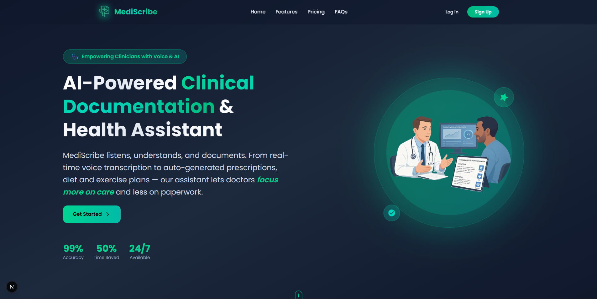
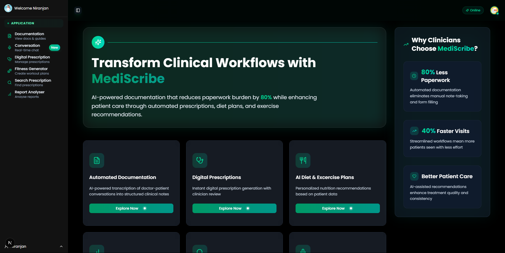
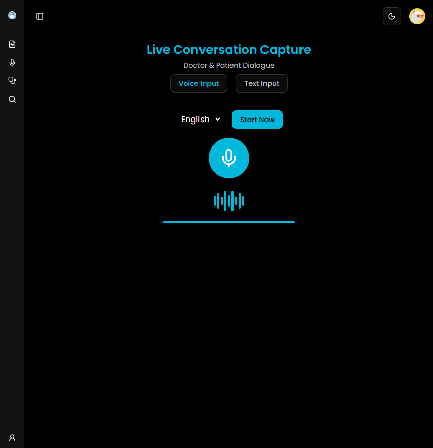
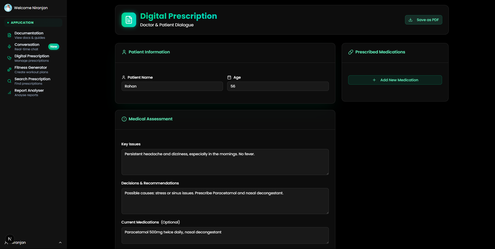
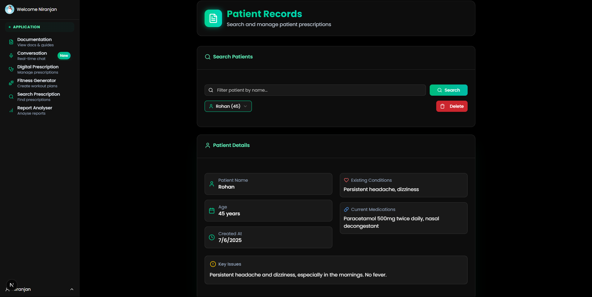

# MediScribe – Simplify Medical Reports & Generative AI-Powered Clinical Documentation 

**Hackathon:** Sankalp 101 Hackathon  
**Team Name:** CODE4CHANGE  
**Team Members:**  
- Debshata Choudhury (Team Leader)   
- Abhishek Chaubhey  
- Vaibhav Jain  
- Niranjan Praveen   

📧 **Contact:** debshatachoudhury@gmail.com 
🔗 **Live Demo:** [https://medi-scribe-pi.vercel.app/](https://medi-scribe-pi.vercel.app/)

---

## 🚀 Problem Statement:
**Health Report Summarizer:**
An AI-powered system that can ingest raw, complex health reports (lab reports, prescriptions, consultation summaries) and output simplified, structured summaries—highlighting key metrics, abnormal values, doctor’s notes, and lifestyle recommendations in plain language.

---

## 🧠 Overview of MediScribe

**MediScribe** is a full-stack SaaS platform that integrates real-time **Generative AI** and **LLM-driven intelligence** to automate doctor–patient consultations. It transforms audio inputs into structured medical documents, prescriptions, and personalized wellness plans—all in real time.

Powered by **Gemini LLM APIs**, MediScribe bridges the gap between healthcare efficiency and human-centered care using:

- 🧾 Medical Report Simplification
- 🎙️ Voice-to-Text Transcription  
- 🗞 Clinical Note Structuring  
- 💊 Digital Prescription Generation  
- 🍎 Personalized Diet & Exercise Plans  
- 🔐 Role-Based Multi-User Access

---

## 🧩 Core Features (LLM-Powered)

- **📄 Medical Report Simplification:**  
  Parses and highlights critical values, diagnoses, prescribed medication, and abnormal readings using LLMs.

- **🎤 Real-time Voice Transcription + NLP:**  
  Uses Gemini Speech-to-Text + LLMs to convert bilingual (Hindi & English) doctor-patient conversations into structured notes.

- **🧠 Generative Clinical Notes:**  
  Extracts and formats chief complaints, history, diagnosis, and treatments using a custom pipeline powered by LLM + MedSpaCy.

- **📄 Digital Prescription Generator:**  
  Auto-generates editable, signed prescriptions in PDF format with clinical context from AI output.

- **🍱 Personalized Health Plans:**  
  AI-generated diet & fitness recommendations based on LLM-analyzed vitals, conditions, and preferences.

- **🧑‍⚕️ Doctor/Admin Dashboards:**  
  Clean review and approval interfaces for clinicians to verify AI-generated outputs.

- **💳 Stripe-Powered Subscription Billing:**  
  Tiered pricing for clinics/hospitals with role-based access and audit trail.

- **📡 EMR Interoperability (FHIR API):**  
  Seamless integration with electronic medical record systems.

---

  
  
  
  



---

## Key Features Include:

- **Voice Transcription & NLP** – Real-time doctor–patient conversation capture in two languages and structured note extraction via Gemini Speech-to-Text and NLP models.  
- **Digital Prescription Generator** – Create, edit, and download prescriptions with digital signature support.  
- **Diet & Exercise Recommendation Engine** – AI-driven, personalized health plans based on patient data.  
- **Clinician Review Interface** – Intuitive dashboard for review, editing, and approval of AI outputs.  
- **Subscription Management** – Stripe-powered tiered SaaS billing and access control.  
- **EMR Integration** – Optional FHIR API connectivity for seamless data exchange.  
- **Multi-User Roles**:
  - *Doctor* – Conduct consultations and finalize notes.  
  - *Assistant* – Manage audio uploads and preliminary reviews.  

---

## AI & Cloud Integration (Simplified Overview)

### Gemini Speech-to-Text Pipeline
- Capture live audio via WebRTC.  
- Stream to **Gemini Speech-to-Text API** for low-latency transcription.  

### Gemini API NLP Extraction
- Parse transcripts into **chief complaints**, **history**, **diagnosis**, and **treatment** sections.  
- Extract critical clinical entities using MedSpaCy.

## Technology Stack:

- **Frontend**: Next.js, Tailwind CSS, ShadCN UI, KindeAuth  
- **Backend**: FastAPI, Flask (Python), Qiskit (for future quantum-powered analytics)  
- **AI/ML**: Gemini API, Scikit-learn  
- **Database**: PostgreSQL (via Prisma/Supabase)  
- **Deployment**: Vercel (frontend), Render (backend)  

---

## Code Execution Instructions:

### 1. Clone the Repository  
```bash
git clone https://github.com/YourOrg/medi-scribe.git
cd medi-scribe
```

### 2. Install Frontend Dependencies  
```bash
cd client
npm install
```

### 3. Install Backend Dependencies  
```bash
cd ../server
pip install -r requirements.txt
```

### 4. Start Development Servers  

#### Frontend (Next.js)  
```bash
cd client
npm run dev
```

#### Backend (FastAPI/Flask)  
```bash
cd ../server
python app.py
```

### 5. Access the Application  
Open [http://localhost:3000](http://localhost:3000) in your browser.

---

## Scalability & Business Model:

- **Subscription Model**: Tiered pricing per clinic, with volume discounts.  
- **Enterprise Integrations**: EMR interoperability for hospitals and chains.  
- **Security & Compliance**: HIPAA/GDPR-ready encryption, role-based access controls.  
- **Modular Architecture**: Easy feature rollout (mobile app, multilingual, analytics).  
- **Affordability**: Pay-as-you-grow pricing, free basic tier for small practices.

---

## Summary
Health Report Summarizer simplifies complex medical documents for clinicians and patients alike. From auto-generating digital prescriptions to highlighting key trends in lab results, the platform transforms the healthcare documentation experience through real-time transcription, AI summarization, and structured outputs.

MediScribe transforms clinical documentation with an **AI-first approach**, combining real-time transcription, structured note extraction via **Gemini API**, and personalized health recommendations into a seamless SaaS platform—empowering clinicians to **reduce administrative overhead**, **improve patient engagement**, and **enhance care quality** in any healthcare setting.

Built with a vision to reduce clinical burnout and improve accessibility, this tool aligns with the Sankalp 101 Hackathon theme of tech-driven social impact in healthcare.
