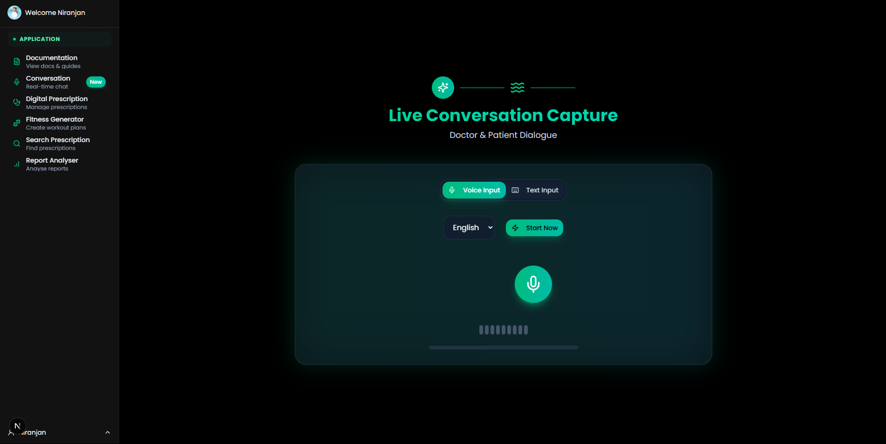
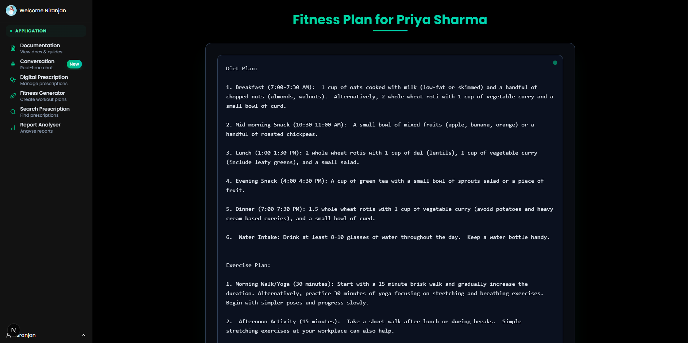

# MediScribe – Generative AI-Powered Clinical Documentation & Assistant WebApp

**Hackathon:** Code For Bharat – Season 2  
**Team Name:** CODE4CHANGE  
**Team Members:**  
- Niranjan Praveen (Team Leader)   
- Abhishek Chaubhey  
- Vaibhav Jain  
- Debshata Choudhury   

📧 **Contact:** heckerhecker86@gmail.com 
🔗 **Live Demo:** [https://medi-scribe-pi.vercel.app/](https://medi-scribe-pi.vercel.app/)

---

## 🚀 Problem Statement:
**Automated Clinical Documentation using Generative AI:**  
Leverage voice recognition and large language models (LLMs) to automatically transcribe, interpret, and generate structured, review-ready clinical notes and personalized treatment plans.

---

## 🧠 Overview of MediScribe

**MediScribe** is a full-stack SaaS platform that integrates real-time **Generative AI** and **LLM-driven intelligence** to automate doctor–patient consultations. It transforms audio inputs into structured medical documents, prescriptions, and personalized wellness plans—all in real time.

Powered by **Gemini LLM APIs**, MediScribe bridges the gap between healthcare efficiency and human-centered care using:

- 🎙️ Voice-to-Text Transcription  
- 🧾 Clinical Note Structuring  
- 💊 Digital Prescription Generation  
- 🍎 Personalized Diet & Exercise Plans  
- 🔐 Role-Based Multi-User Access

---

## 🧩 Core Features (LLM-Powered)

- **🎤 Real-time Voice Transcription + NLP:**  
  Uses Gemini Speech-to-Text + LLMs to convert bilingual (Hindi & English) doctor-patient conversations into structured notes.

- **🧠 Generative Clinical Notes:**  
  Extracts and formats chief complaints, history, diagnosis, and treatments using a custom pipeline powered by LLM + MedSpaCy.

- **📄 Digital Prescription Generator:**  
  Auto-generates editable, signed prescriptions in PDF format with clinical context from AI output.

- **🍱 Personalized Health Plans:**  
  AI-generated diet & fitness recommendations based on LLM-analyzed vitals, conditions, and preferences.

- **🧑‍⚕️ Doctor/Admin Dashboards:**  
  Clean review and approval interfaces for clinicians to verify AI-generated outputs.

- **💳 Stripe-Powered Subscription Billing:**  
  Tiered pricing for clinics/hospitals with role-based access and audit trail.

- **📡 EMR Interoperability (FHIR API):**  
  Seamless integration with electronic medical record systems.

---

  
  
  
  



---

## Key Features Include:

- **Voice Transcription & NLP** – Real-time doctor–patient conversation capture in two languages and structured note extraction via Gemini Speech-to-Text and NLP models.  
- **Digital Prescription Generator** – Create, edit, and download prescriptions with digital signature support.  
- **Diet & Exercise Recommendation Engine** – AI-driven, personalized health plans based on patient data.  
- **Clinician Review Interface** – Intuitive dashboard for review, editing, and approval of AI outputs.  
- **Subscription Management** – Stripe-powered tiered SaaS billing and access control.  
- **EMR Integration** – Optional FHIR API connectivity for seamless data exchange.  
- **Multi-User Roles**:
  - *Doctor* – Conduct consultations and finalize notes.  
  - *Assistant* – Manage audio uploads and preliminary reviews.  

---

## AI & Cloud Integration (Simplified Overview)

### Gemini Speech-to-Text Pipeline
- Capture live audio via WebRTC.  
- Stream to **Gemini Speech-to-Text API** for low-latency transcription.  

### Gemini API NLP Extraction
- Parse transcripts into **chief complaints**, **history**, **diagnosis**, and **treatment** sections.  
- Extract critical clinical entities using MedSpaCy.

## Technology Stack:

- **Frontend**: Next.js, Tailwind CSS, ShadCN UI, KindeAuth  
- **Backend**: FastAPI, Flask (Python), Qiskit (for future quantum-powered analytics)  
- **AI/ML**: Gemini API, Scikit-learn  
- **Database**: PostgreSQL (via Prisma/Supabase)  
- **Deployment**: Vercel (frontend), Render (backend)  

---

## Code Execution Instructions:

### 1. Clone the Repository  
```bash
git clone https://github.com/YourOrg/medi-scribe.git
cd medi-scribe
```

### 2. Install Frontend Dependencies  
```bash
cd client
npm install
```

### 3. Install Backend Dependencies  
```bash
cd ../server
pip install -r requirements.txt
```

### 4. Start Development Servers  

#### Frontend (Next.js)  
```bash
cd client
npm run dev
```

#### Backend (FastAPI/Flask)  
```bash
cd ../server
python app.py
```

### 5. Access the Application  
Open [http://localhost:3000](http://localhost:3000) in your browser.

---

## Scalability & Business Model:

- **Subscription Model**: Tiered pricing per clinic, with volume discounts.  
- **Enterprise Integrations**: EMR interoperability for hospitals and chains.  
- **Security & Compliance**: HIPAA/GDPR-ready encryption, role-based access controls.  
- **Modular Architecture**: Easy feature rollout (mobile app, multilingual, analytics).  
- **Affordability**: Pay-as-you-grow pricing, free basic tier for small practices.

---

## Summary

MediScribe transforms clinical documentation with an **AI-first approach**, combining real-time transcription, structured note extraction via **Gemini API**, and personalized health recommendations into a seamless SaaS platform—empowering clinicians to **reduce administrative overhead**, **improve patient engagement**, and **enhance care quality** in any healthcare setting.